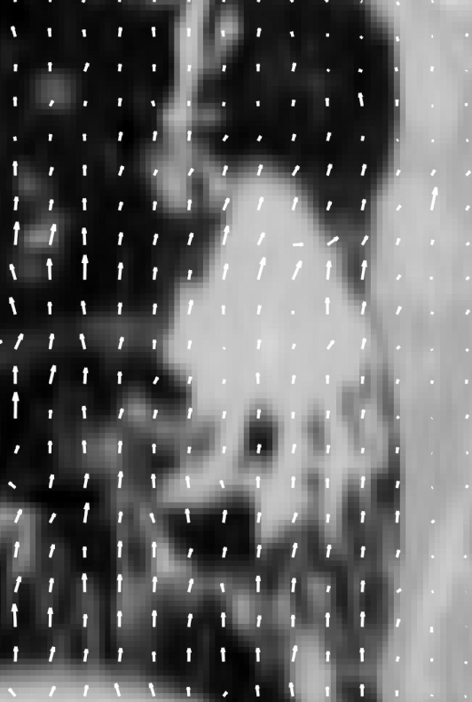

This repository is the first of a series of three repositories containing code that we used in the research corresponding to the following article:

Michel Pohl, Mitsuru Uesaka, Kazuyuki Demachi, Ritu Bhusal Chhatkuli, "Prediction of the motion of chest internal points using a recurrent neural network trained with real-time recurrent learning for latency compensation in lung cancer radiotherapy",
Computerized Medical Imaging and Graphics,
Volume 91,
2021,
101941,
ISSN 0895-6111

You can access it with the following links:
 - https://doi.org/10.1016/j.compmedimag.2021.101941 (journal version with restricted access)
 - https://doi.org/10.48550/arXiv.2207.05951 (accepted manuscript version, openly available)

The code in this repository computes the deformation vector field (DVF) of a series of 3D images. It registers the first image with the others by using the pyramidal Lucas-Kanade optical flow algorithm. The two other repositories corresponding to the article mentioned above are the following:
 - Time series prediction with an RNN trained with RTRL: https://github.com/pohl-michel/Time-series-prediction-with-an-RNN-trained-with-RTRL
 - 3D image warping using Nadaraya-Watson non-linear regression: https://github.com/pohl-michel/Time-series-prediction-with-an-RNN-trained-with-RTRL

Please kindly consider citing our article if you use this code in your research. Also, please do not hesitate to look at the other two repositories mentioned above.

The animation below shows the computed DVFs (the 2D coronal projection of the computed 3D DVFs) corresponding to the motion of a lung tumor on top of the initial tumor image (the coronal cross-section of the initial 3D image). The vectors point up and down as the tumor moves with the breathing motion.

Our implementation is based on the following research article (there are some small differences though):
Bouguet, Jean-Yves, 
"Pyramidal implementation of the affine Lucas Kanade feature tracker description of the algorithm.", 
Intel corporation 5.1-10 (2001): 4. 

The main function to execute is "Lucas_Kanade_Pyramidal_Optical_Flow_Main.m".
The input image sequence is placed in the "Input images" folder.
Parameters concerning the image sequence itself, the DVF calculation, and the DVF display
are located respectively in the "3Dim_seq_par.xlsx" file, the "3DOF_calc_par.xlsx" file, and the "3Ddisp_par.xlsx" file.

The behavior of the program is controlled by the `beh_par` structure defined in `load_behavior_parameters3D()`,
and its fields can be changed manually.
Also, the name of the input sequences whose DVF is computed needs to be specified in the `input_im_dir_suffix_tab` array.

The resulting DVF, the DVF visualization, and the evaluation log files 
will be saved respectively in the folders "Optical flow calculation results mat files",
"Optical flow projection images", and "Log files".
The root-mean-square error (RMSE) of the registration can be found in that log file.

We also included three 4DCT sequences of tumors of patients with lung cancer,
acquired by a 16-slice helical CT simulator (Brilliance Big Bore, Philips Medical System)
in Virginia Commonwealth University Massey Cancer Center,
which were downloaded from the Cancer Imaging Archive open database.

Also, by running "Lucas_Kanade_Pyramidal_Optical_Flow_Optimization_Main.m", one can perform hyper-parameter optimization by grid search to find an accurate DVF.
The hyper-parameters grid is specified in the file "load_3DOF_hyperparameters.m".
The results of the optimization is saved in the files "DVF optim log file.txt" and "DVF hyperpar influence (date and time).txt" 

The images that we used come from the TCIA 4D-lung dataset publicly available here: https://wiki.cancerimagingarchive.net/display/Public/4D-Lung

----------------------------------------------
Update (10th October 2024): An adaptation of the code in this repository for 2D image registration (instead of 3D) is available here: https://github.com/pohl-michel/2D-MR-image-prediction. That new repository focuses mainly on video forecasting but it contains an implementation of the iterative and pyramidal Lucas-Kanade optical flow algorithm and a script to perform parameter optimization with grid search as well.

